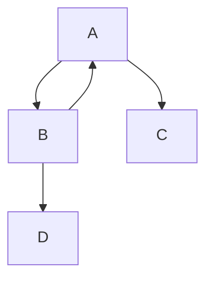

# Mermaid Testing

[Link to page2](./page2.md).

Inhalt...
* 1 Test
* 2 Test
* 3 Test

<!-- generated by mermaid compile action - START -->

  
Mermaid markup

<!-- generated by mermaid compile action - END -->
