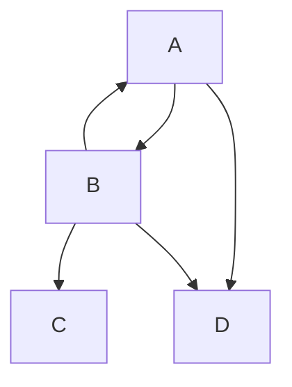

# Mermaid Testing

[Link to page2](./page2.md).

Testinhalt 
* 1
* 2
* 3

<!-- generated by mermaid compile action - START -->

  
Mermaid markup

<!-- generated by mermaid compile action - END -->
