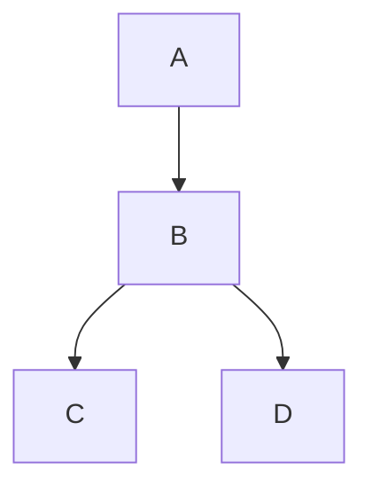

# Title of mainpage here

[Link to another page](./page2.md).

Test 123

<!-- generated by mermaid compile action - START -->

  
Mermaid markup

```mermaid
graph TD;
    A-->B;
    B-->C;
    B-->D;
```

<!-- generated by mermaid compile action - END -->
