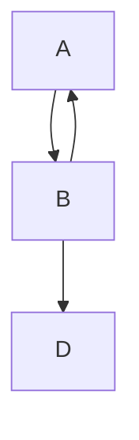

# Mermaid Testing

[Link to page2](./page2.md).

Inhalt...
* 1 Test 19
* 2 Test 7
* 3 Test3

<!-- generated by mermaid compile action - START -->

  
Mermaid markup

<!-- generated by mermaid compile action - END -->
