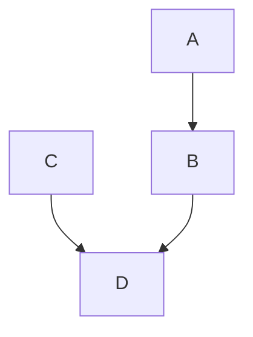

# This is the mainpage in markdown

Inhalt...
* Test **tes**

<!-- generated by mermaid compile action - START -->

  
Mermaid markup

```mermaid
graph TD;
    A-->B;
    C-->D;
    B-->D;
```

<!-- generated by mermaid compile action - END -->

